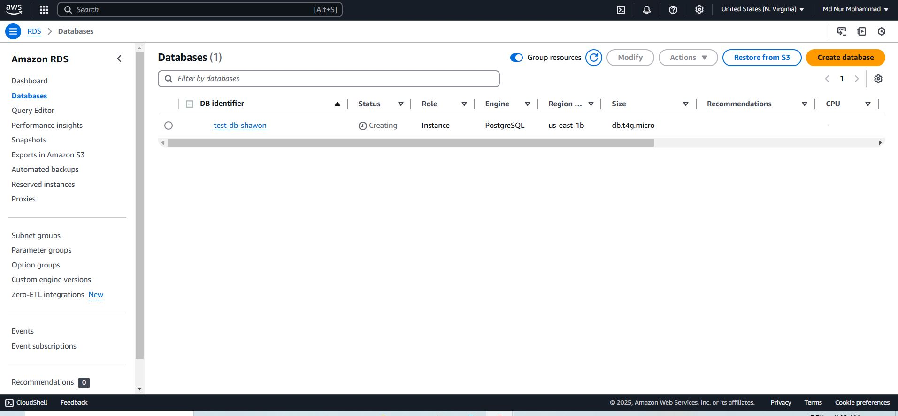
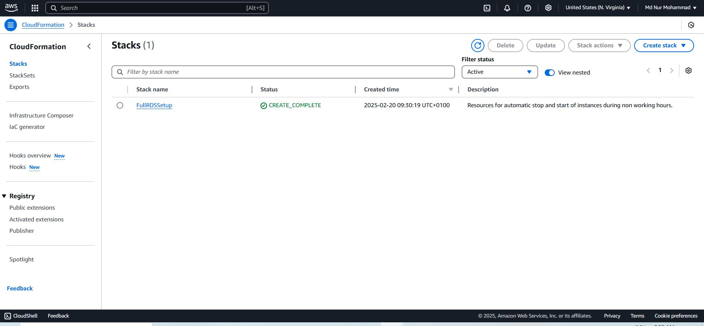
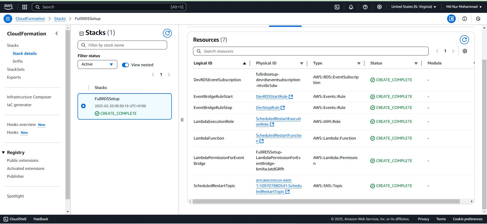
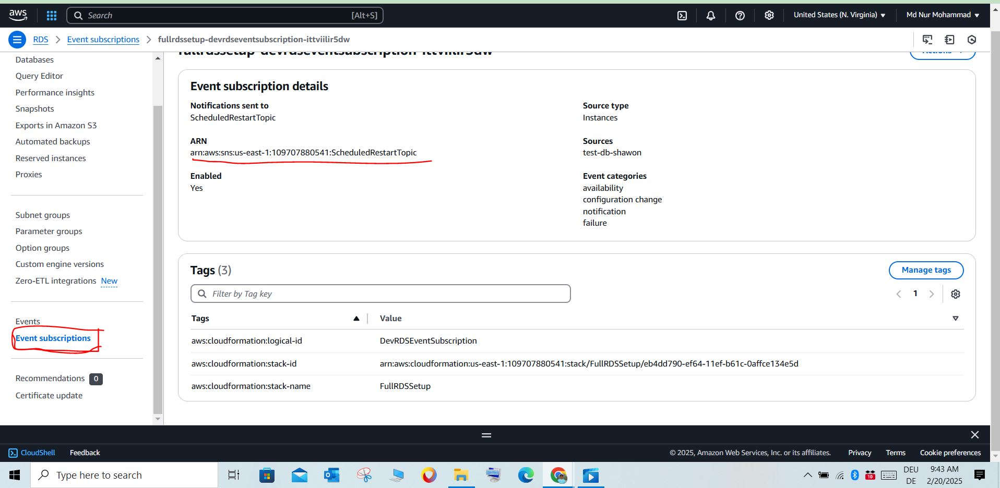
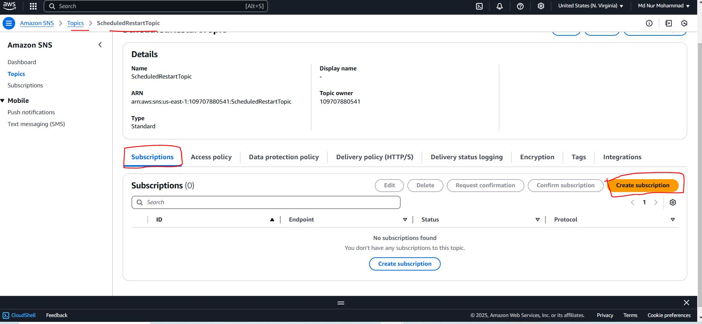
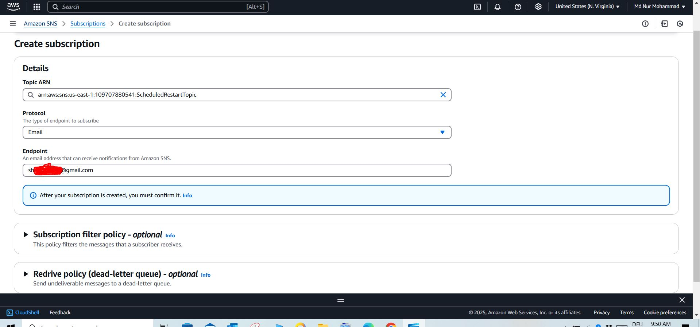
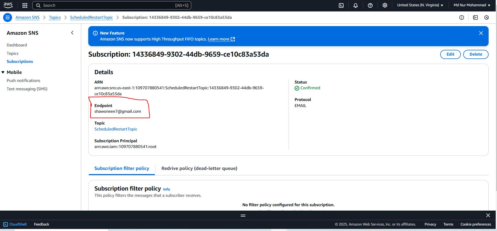
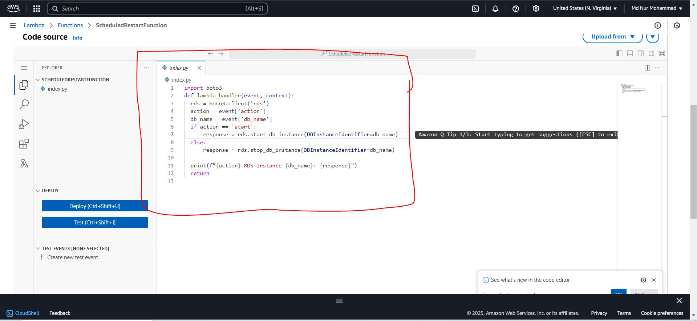
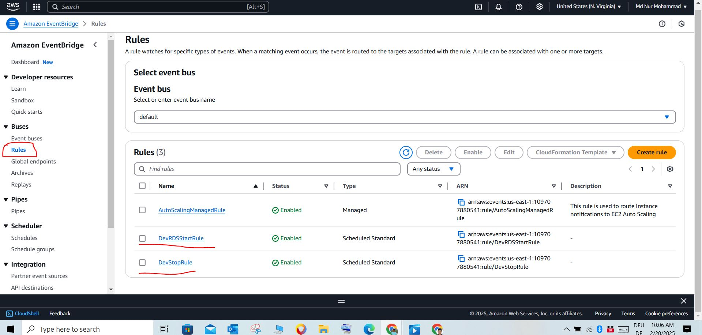

# Scheduling-AWS-RDS-and-sending-notifications.

## Short Project Summary ##

Automated scheduling of AWS RDS instances with real-time notifications using AWS services like Lambda, EventBridge, SNS, and CloudFormation. This setup reduces unnecessary resource usage by starting and stopping RDS instances based on a defined schedule while keeping users informed through email notifications.

## This project demonstrates how to automate the scheduling of AWS RDS PostgreSQL instances using AWS Lambda, EventBridge, SNS, and CloudFormation. ##
It includes:

1. **Scheduled Automation:** RDS instances start at 7 AM and stop at 9 PM (UTC), Monday–Friday.

2. **Notifications:** Real-time SNS email notifications for availability, configuration changes, and failures.

3. **Cost Optimization:** Stops non-production RDS instances during off-hours to minimize costs.

4. **Infrastructure as Code (IaC):** Entire workflow is deployable via a single CloudFormation YAML file.

5. **Serverless Architecture:** Uses Lambda functions with IAM roles for secure RDS management.

## Technical Overview ##

1. AWS RDS Setup: PostgreSQL instance configured under the free tier for testing.

2. CloudFormation Template:

3. SNS Topic for sending RDS notifications.

4. RDS Event Subscription to track key database events.

5. Lambda Function to start/stop RDS instances using Python (boto3).

6. EventBridge Rules for triggering Lambda actions on schedule.

7. IAM Roles to ensure secure execution of Lambda functions.

8. SNS Email Subscription: Users receive confirmation and real-time updates.

9. EventBridge Integration: Defines cron expressions to control RDS availability during working hours.


**Create RDS in AWS**

1. Go to the RDS page and choose Standard create > PostgreSQL
2. Engine version > choose latest one.
3. Templates > Free tier. ( for test case)
4. DB instance identifier > give a unique name. this identifier will use in cloud formation template.
5. Master user name > use a user name & Master password > choose a password. (Remember this user name and password)
6. Public acess > I choosed Yes . (Normally DB should not be public)
7. Additional configuration > initial database name > give a name.
8. Now create database.



Note: It will take few minutes.

*Now open cloud shell*
create a YAML file by running the following command.
```bash
nano shawon.yaml
```

now peste the configuration file and edit it according to your new ARN and identifier.

```yml
AWSTemplateFormatVersion: "2010-09-09"
Description: Resources for automatic stop and start of instances during non working hours.

Resources:
  # 1. SNS Topic for RDS Notifications
  ScheduledRestartTopic:
    Type: AWS::SNS::Topic
    Properties:
      TopicName: ScheduledRestartTopic

  # 2. RDS Event Subscription
  DevRDSEventSubscription:
    Type: AWS::RDS::EventSubscription
    Properties:
      SnsTopicArn: !Ref ScheduledRestartTopic
      SourceType: "db-instance"
      EventCategories:
        - "availability"
        - "configuration change"
        - "notification"
        - "failure"
      SourceIds:
        - "test-db-shawon"
      Enabled: true

  # 3. IAM Role for Lambda
  LambdaExecutionRole:
    Type: AWS::IAM::Role
    Properties:
      RoleName: ScheduledRestartExecutionRole
      AssumeRolePolicyDocument:
        Version: "2012-10-17"
        Statement:
          - Effect: Allow
            Principal:
              Service: lambda.amazonaws.com
            Action: sts:AssumeRole
      Policies:
        - PolicyName: ScheduledRestartPolicy
          PolicyDocument:
            Version: "2012-10-17"
            Statement:
              # Logs permissions
              - Effect: Allow
                Action:
                  - logs:CreateLogGroup
                  - logs:CreateLogStream
                  - logs:PutLogEvents
                Resource: "arn:aws:logs:*:*:*"

              # Start and Stop RDS instance permissions
              - Effect: Allow
                Action:
                  - rds:StartDBInstance
                  - rds:StopDBInstance
                Resource: "arn:aws:rds:us-east-1:109707880541:db:test-db-shawon"

  # 4. Lambda Function (Inline Python Code)
  LambdaFunction:
    Type: AWS::Lambda::Function
    Properties:
      FunctionName: ScheduledRestartFunction
      Runtime: python3.13
      Handler: index.lambda_handler
      Role: !GetAtt LambdaExecutionRole.Arn
      Code:
        ZipFile: |
          import boto3
          def lambda_handler(event, context):
            rds = boto3.client('rds')
            action = event['action']
            db_name = event['db_name']
            if action == 'start':
                response = rds.start_db_instance(DBInstanceIdentifier=db_name)
            else:
                response = rds.stop_db_instance(DBInstanceIdentifier=db_name)

            print(f"{action} RDS Instance {db_name}: {response}")
            return

  # 5. EventBridge Rule 1 - Start DB at 7:00 AM (Monday to Friday) (Time is always in UTC format)
  EventBridgeRuleStart:
    Type: AWS::Events::Rule
    Properties:
      Name: DevRDSStartRule
      ScheduleExpression: "cron(0 6 ? * MON-FRI *)"  
      State: ENABLED
      Targets:
        - Arn: !GetAtt LambdaFunction.Arn
          Id: DevRDSStartAction
          Input: '{"action": "start", "db_name": "test-db-shawon"}'

  # 6. EventBridge Rule 2 - Stop DB at 9:00 PM (Monday to Friday) (Time is always in UTC format)
  EventBridgeRuleStop:
    Type: AWS::Events::Rule
    Properties:
      Name: DevStopRule
      ScheduleExpression: "cron(0 20 ? * MON-FRI *)" 
      State: ENABLED
      Targets:
        - Arn: !GetAtt LambdaFunction.Arn
          Id: DevRDSStopAction
          Input: '{"action": "stop", "db_name": "test-db-shawon"}'
          

  # 7. Permissions for EventBridge to invoke Lambda
  LambdaPermissionForEventBridge:
    Type: AWS::Lambda::Permission
    Properties:
      FunctionName: !Ref LambdaFunction
      Action: "lambda:InvokeFunction"
      Principal: "events.amazonaws.com"
```
Note: Remeber change your identifier and ARN .

Now run the command bellow into your cloud shell where actually you have created a YAML config file.

```bash
aws cloudformation deploy --stack-name FullRDSSetup --template-file shawon.yaml --capabilities CAPABILITY_NAMED_IAM
```
It will take some times. When it complete go to the cloudformation the you will see stacks created.




If we go through our created CloudFormation stack > resources we will see what steps are doing CloudFormations.



Now go to the RDS database page. select Event Subscriptions ( in the left side). select it and we will see here event took ARN for sns.




**Now go to the Amazon SNS service**

Choose Topics . Here we will see our topic created. 


Now we will do subscriptions of it. For that go to the subscription page. 




Now click create Subdscriptions. > Choose protocol "Email"
Endpoint > give your email address. 
After that, create subscriptions. now go to your email and confirm this settings.




Once you confirmed your email it shows that email confirmed.




**Now Lambda Functions**

Go to the lambda functions and we will see there is a fuction created. We did it through cloud formations.
Inside the function we can see python code also is came here. 




**Now EventBridge**

Go to the EventBridge > Rules . We will see what actually did Event´Bridge. We can see DB start and stop rules are active.




**Checking the DB status with SNS**

Now go to the RDS database page. Stop DB manually. wait a bit and you will get NSN notifications. 


